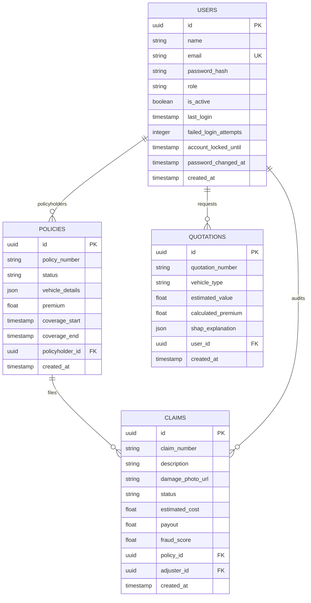

# Database Schema Documentation

This document describes the PostgreSQL 17 relational database tables, constraints, fields, index setups, and SQLAlchemy ORM relationships.

---

## 🗄️ Database ER Layout Diagram



---

## 📝 Column Specifications & Constraints

### 1. `users` Table
Stores secure accounts details, role associations, and login lockout flags.
* `id` (`UUID`, Primary Key, Unique, Default: `uuid_generate_v4()`)
* `name` (`VARCHAR(150)`, Not Null)
* `email` (`VARCHAR(255)`, Unique Index, Not Null)
* `password_hash` (`VARCHAR(255)`, Not Null)
* `role` (`VARCHAR(50)`, Not Null)
* `is_active` (`BOOLEAN`, Default: `True`)
* `failed_login_attempts` (`INTEGER`, Default: `0`)
* `account_locked_until` (`TIMESTAMP`, Nullable)
* `password_changed_at` (`TIMESTAMP`, Default: `CURRENT_TIMESTAMP`)
* `created_at` (`TIMESTAMP`, Default: `CURRENT_TIMESTAMP`)

### 2. `policies` Table
* `id` (`UUID`, Primary Key)
* `policy_number` (`VARCHAR(100)`, Unique Index)
* `status` (`VARCHAR(50)`)
* `vehicle_details` (`JSONB`, stores attributes like model, year, license plates)
* `premium` (`NUMERIC(12,2)`)
* `policyholder_id` (`UUID`, Foreign Key pointing to `users.id`)

### 3. `quotations` Table
* `id` (`UUID`, Primary Key)
* `quotation_number` (`VARCHAR(100)`, Unique Index)
* `vehicle_type` (`VARCHAR(50)`)
* `calculated_premium` (`NUMERIC(12,2)`)
* `shap_explanation` (`JSONB`, explanation feature lists)
* `user_id` (`UUID`, Foreign Key pointing to `users.id`)

### 4. `claims` Table
* `id` (`UUID`, Primary Key)
* `claim_number` (`VARCHAR(100)`, Unique Index)
* `status` (`VARCHAR(50)`: Pending, Approved, Rejected)
* `estimated_cost` (`NUMERIC(10,2)`)
* `fraud_score` (`NUMERIC(4,2)`)
* `policy_id` (`UUID`, Foreign Key pointing to `policies.id`)

---

## 🚀 Migration Control
Schema updates are synchronized using Alembic migrations (configured in `alembic.ini` and scripts in the `alembic/` folder).
To execute all pending DDL schemas:
```bash
alembic upgrade head
```
