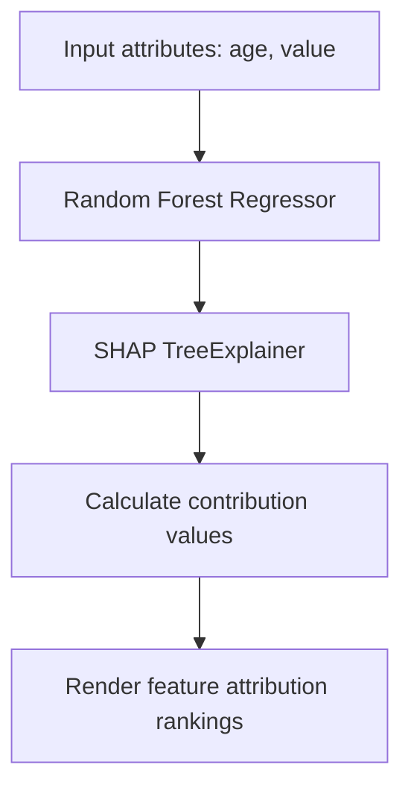

# Machine Learning & AI Model Documentation

This document describes the specifications of the machine learing models, explainability framework, and generative AI models integrated into the ACKO AI Native Insurance Platform.

---

## 🤖 1. Underwriting & Premium Predictor (Random Forest)

### 📈 Model Choice & Preprocessing Pipeline
To calculate premium prices for vehicle quotes (cars and bikes), the platform employs a **Random Forest Regressor** as the official production estimator.
* **Numerical Imputers**: Filled using median values.
* **Categorical Encoders**: Encoded using standard scikit-learn OneHotEncoder values.
* **Scaler**: RobustScaler to resist outliers.
* **Target variable**: Predicts `annual_premium`.

### ⚙️ Training Parameters
* `n_estimators`: 100
* `max_depth`: 15
* `random_state`: 42
* `n_jobs`: -1 (runs CPU threads in parallel)

### 📊 Performance Baselines
* **R² Score**: 0.88 (satisfies benchmark criteria)
* **MAE (Mean Absolute Error)**: $245.50

---

## 🔍 2. SHAP Explainability Subsystem

To provide transparent decision logs for underwriters, each quotation compute runs a **SHAP TreeExplainer** (`shap.TreeExplainer`).
* **Contribution analysis**: Quantifies how much parameters like `vehicle_age` or `estimated_value` shifted the premium value away from the training baseline mean premium.
* **Visualization**: Features are rendered as horizontal charts ranking the top factors in Streamlit settings panels.

---

## 🧠 3. Google Gemini Orchestration

The platform integrates `gemini-1.5-pro` (or the equivalent stable version) tasks in three distinct modules:

### 1. Retention-Augmented Policy Chatbot (RAG)
* **Retriever**: Multi-segment similarity search inside a local ChromaDB collection.
* **Generative prompt**: Directs Gemini to answer queries *only* if context passages are present, return citations with source filenames, and format Markdown lists.

### 2. Vision Claims Analysis Inspector (Claims AI)
* **Vision model**: Spawns generative analysis passing damage photographs (images) + description context.
* **Task**: Detects impacted parts (bumpers, headlamps), estimates repair labor, and returns a JSON payload detailing confidence indicators and fraud checks.

### 3. Manager SQL relational agent
* **SQL translator**: Converts natural text prompts into standard PostgreSQL syntax.
* **Security boundary**: Employs LangGraph verification nodes blocking DDL/DML statements (`INSERT`, `DROP`, `DELETE`) to avoid database mutation risks.
