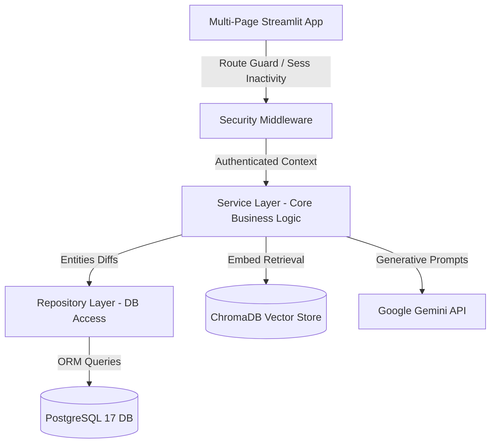
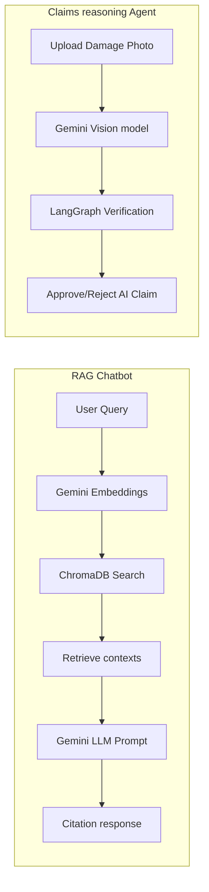

# Project Architecture: ACKO AI Native Insurance Platform

This document describes the design architecture, directory layout, horizontal tiers, and subsystem integrations of the ACKO AI Native Insurance Platform.

---

## 🏗️ 1. Multi-Tier Architectural Blueprints

The platform strictly adheres to a decoupled, 4-tier enterprise design pattern:

### 💻 Tier 1: Domain UI (Streamlit Pages)
* Coordinates page states in `app.py`.
* Injects unified glassmorphism styling (`Outfit` font family typography, dark card containers).
* Enforces role verification gate checking on navigation choices.

### 🛡️ Tier 2: Security & Routing Middleware
* **Inactivity Tracker**: Log users out automatically after 15 minutes of session inactivity.
* **Access Controller**: Maps permissions to five enterprise roles: Customer, Underwriter, Claims Officer, Manager, Administrator.

### ⚙️ Tier 3: Business Service Layer (`src/services/`)
* Runs target validations, calculates quotes using machine learning models, handles RAG integrations, and coordinates claims reasoning audits.

### 🗄️ Tier 4: Relational & Vector Persistence
* **PostgreSQL Database**: Handled via SQLAlchemy 2.0 ORM sessions.
* **ChromaDB Vector Storage**: Hosts parsed PDF policy pages for context similarity querying.

---

## 🛠️ 2. Core Operational Subsystems

### 1. Retention-Augmented Chatbot (RAG)
* Uses `ChromaVectorStore` to index policy terms.
* Generates Gemini generative answers accompanied by document citation sources and page reference numbers.

### 2. Underwriting Machine Learning Pipeline
* Processes vehicle attributes (make, value, age, engine capacity) and feeds them to Scikit-Learn estimators.
* Employs SHAP explainers to calculate feature attribution parameters (explanation vectors) so underwriters see why a premium was priced.

### 3. Claims Processing Vision Agent (Claims AI)
* Inspects uploaded damage photographs using Gemini Vision API.
* Checks claim attributes (cost, vehicle history, estimated repairs) inside a LangGraph auditor evaluating fraud risks, approval boundaries, and payout limits.

### 4. Manager Relational Agent (Text-to-SQL)
* Converts natural language questions from managers (e.g., *"How many claims are pending?"*) into SQL queries.
* Executes queries against the PostgreSQL database and formats tables for executives.

---

## 🐳 3. Deployment & Security Standards
* Strict environment isolation using a local `.env` settings profile.
* Password hashing using bcrypt.
* Activity and performance audit logging to dynamic rotating files (`logs/auth.log`, `logs/prediction.log`, etc.).
