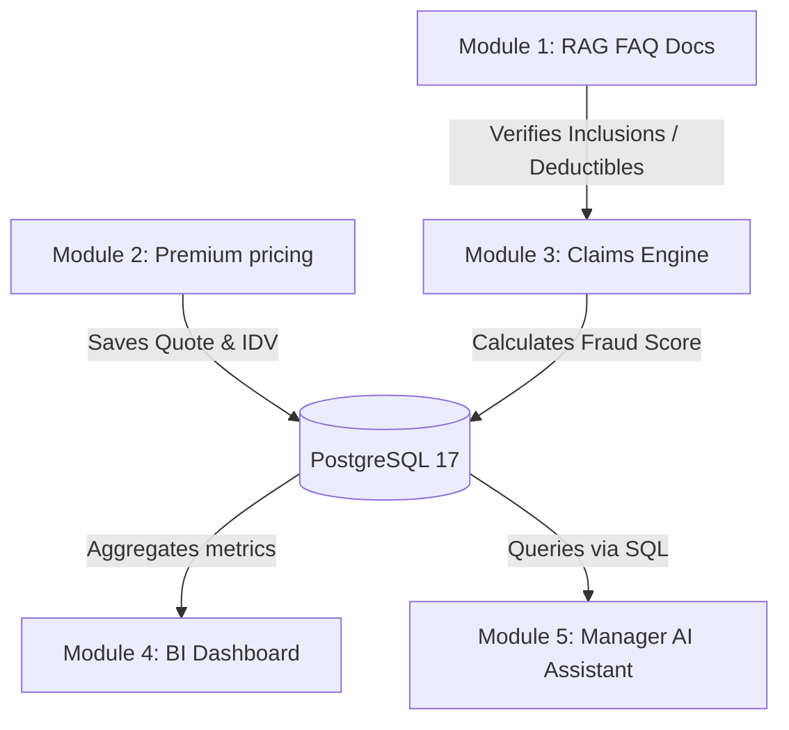

# Master Dataset Analysis & Comparative Report
**Project Name**: ACKO AI Native Insurance Platform  
**Phase**: 2.1 Dataset Profiling & Business Understanding  
**Audience**: Senior Data Scientists & AI Engineers

---

## 1. Executive Summary

This master report synthesizes and compares the profiling results of the four core datasets in the ACKO AI Native Insurance Platform:
1.  **Car Quotation Dataset** (`acko_car_quotation.csv`) - Underwriting Premium Pricing
2.  **Bike Quotation Dataset** (`acko_bike_quotation.csv`) - Underwriting Premium Pricing
3.  **Car Claims Dataset** (`acko_car_claims.csv`) - Claims Auto-Adjudication
4.  **Bike Claims Dataset** (`acko_bike_claims.csv`) - Claims Auto-Adjudication

The primary goal of this phase is to establish a rigorous understanding of the data before building models, designing databases, or creating UI components. Our profiling has identified critical insights regarding data quality (specifically primary key duplicate issues), electric vehicle powertrain mapping, and severe target data leakage risks that must be resolved prior to model development.

---

## 2. Comparative Analysis Table

The following matrix compares the core characteristics of the four datasets:

| Metric | Car Quotation | Bike Quotation | Car Claims | Bike Claims |
| :--- | :--- | :--- | :--- | :--- |
| **Row Count** | 200,000 | 150,000 | 150,000 | 100,000 |
| **Column Count** | 28 | 28 | 32 | 34 |
| **Disk Size** | 39.2 MB | 27.9 MB | 29.5 MB | 21.0 MB |
| **Target Variable** | `annual_premium` | `annual_premium` | `claim_approved` | `claim_approved` |
| **Target Type** | Continuous (Regression)| Continuous (Regression)| Binary (Classification)| Binary (Classification)|
| **Missing Values** | `previous_insurer` (11.1%), `addons_list` (25.1%) | `addons_list` (40.1%) | None (0%) | None (0%) |
| **Duplicate IDs** | 6 record IDs | 1 record ID | 5 record IDs | 0 record IDs |
| **EV Rows Ratio** | 15.98% (`fuel_type`="Electric") | 32.07% (`fuel_type`="Electric") | 16.07% (`segment`="ev") | 32.11% (`segment`="ev_scooter") |
| **Target Skew / Ratio** | Right-skewed (Max: 1.6M)| Right-skewed (Max: 252k)| 85.6% Approved / 14.4% Denied | 88.6% Approved / 11.4% Denied |
| **Core Leakage Risk** | `od_premium_before_ncb`, `ncb_discount_amount`, `tp_premium`, `addon_premium`, `gst_amount` | `od_premium_before_ncb`, `ncb_discount_amount`, `tp_premium`, `addon_premium`, `gst_amount` | `approval_probability` | `approval_probability` |

---

## 3. Structural Comparison

### Car vs. Bike Quotation Datasets:
*   **Target Scale**: Car quotations have a much higher pricing ceiling ($16 \text{ Lakh}$ INR) compared to bikes ($2.5 \text{ Lakh}$ INR), which is consistent with the higher market value of cars.
*   **Powertrain Distribution**: Electric vehicle penetration is significantly higher in the bike dataset ($32\%$ of bike quotes are EV scooters) compared to the car dataset ($16\%$).
*   **Rivals vs. Commercials**: Car quotation includes `previous_insurer` ($11\%$ nulls) to capture competitor churn dynamics. Bike quotation instead includes `usage_type` (Personal, Commercial, Delivery) because usage characteristics are a primary driver of bike risk.

### Car vs. Bike Claims Datasets:
*   **Behavioral Risk vs. Mechanical Risk**: 
    *   The bike claims dataset includes rider-specific risk indicators: `rider_experience_years` and `helmet_worn`. Compliance with helmet regulations directly impacts personal injury claim payouts.
    *   The car claims dataset focus on vehicle-specific coverages: `engine_protection_addon` and `zero_dep_addon` are used to check if mechanical repairs are covered.
*   **Parts Complexity**: Car claims contain a higher number of affected parts per claim (up to 6 parts) compared to bikes (up to 5 parts).

---

## 4. Key Data Quality Findings

Before beginning implementation, the following data quality issues must be resolved:

### 1. The `record_id` Primary Key Issue
*   *Observation*: The `record_id` column contains duplicate IDs across unique rows in the car quotation, bike quotation, and car claims datasets. 
*   *Impact*: Relying on `record_id` as a database primary key will cause database constraints to fail.
*   *Solution*: Generate a unique surrogate primary key (such as an auto-incrementing integer or UUID) in PostgreSQL, and treat `record_id` as transaction metadata.

### 2. The Electric Vehicle Engine CC Representation
*   *Observation*: EVs (`segment`="ev" or "ev_scooter") show `engine_cc` = 0.
*   *Impact*: While technically correct (electric vehicles do not have cubic capacity engines), a value of 0 can distort scaling algorithms and distance-based estimators.
*   *Solution*: Keep the 0 values but ensure the model uses a binary `is_electric` flag to help tree-based algorithms split the data correctly.

### 3. Actuarial and Target Data Leakage Columns
*   *Observation*: 
    *   The quotation datasets contain intermediate billing components (`od_premium_before_ncb`, `ncb_discount_amount`, `tp_premium`, `addon_premium`, and `gst_amount`) that directly calculate the target `annual_premium`.
    *   The claims datasets contain `approval_probability`, which is derived directly from the `claim_approved` target.
*   *Impact*: Keeping these columns in the training data will result in artificial accuracy scores during testing that fail in production.
*   *Solution*: These columns must be dropped from the feature set before training ML models. The models must predict premiums and claim approvals using only the raw risk factors (demographics, vehicle age, IDV, location, incident type).

---

## 5. Preprocessing & ML Pipeline Strategy

We will implement a unified preprocessing pipeline in Scikit-learn using `ColumnTransformer` to prepare the data for training:

```text
[Raw Input Data]
       │
       ├──► Numeric Columns ──► Impute Median ──► RobustScaler / MinMaxScaler
       │
       ├──► Low-Card Categorical ──► Impute "Missing" ──► One-Hot Encoding
       │
       ├──► High-Card Categorical ──► Impute "Missing" ──► Target Encoding
       │
       └──► Comma-List Addons/Parts ──► Fill "None" ──► MultiLabelBinarizer
```

1.  **Imputation Layer**:
    *   Impute high-cardinality missing categoricals (e.g. `previous_insurer`) with a `"New/Unknown"` placeholder.
    *   Impute missing values in `addons_list` with `"No Addons"`.
2.  **Encoding Layer**:
    *   Use One-Hot Encoding for low-cardinality features (e.g., `policy_type`, `fuel_type`, `usage_type`).
    *   Use Target Encoding for high-cardinality features (e.g., `city`, `vehicle_model`) to prevent column expansion.
    *   Use `MultiLabelBinarizer` to expand comma-separated lists (`addons_list`, `affected_parts`) into individual binary columns.
3.  **Scaling Layer**:
    *   Use `RobustScaler` for highly skewed numerical features (`idv`, `claim_amount`) to handle outliers.
    *   Use `StandardScaler` for normal distributions (`customer_age`, `engine_cc`).
    *   Use `MinMaxScaler` for bounded variables (`ncb_percent`, `policy_age_months`).
4.  **Target Transformation**:
    *   Apply a log transformation (`numpy.log1p`) to the `annual_premium` target variable during training, and exponentiate predictions (`numpy.expm1`) for user display.

---

## 6. Business Value & Cross-Module Integration

This analysis establishes the business rules and data mappings that connect all five modules of the platform:



*   **RAG Integration (Module 1 & 3)**:
    The RAG policy documents detail coverage inclusions (e.g. Zero Depreciation, Roadside Assistance) and deductible rules. These rules directly validate the logic in the **Claims Engine** (Module 3)—checking if the customer's selected addons match their claims request.
*   **Vision to ML Pipeline (Module 3)**:
    When a customer files a claim, **Gemini Vision** inspects the uploaded accident photo and extracts a structured JSON object containing:
    *   `damage_severity_score` (mapped directly to the ML model's 1-10 severity input).
    *   `affected_parts` (binarized and compared against the text list entered by the customer).
    These features serve as key inputs to the Scikit-learn Fraud Classifier to detect discrepancies.
*   **BI & Agent Ingestion (Module 4 & 5)**:
    The database schemas designed from these datasets allow the **Analytics Dashboard** to aggregate financial metrics (loss ratios, average claim amounts) and enable the **Manager AI Assistant** to generate SQL queries on demand.
