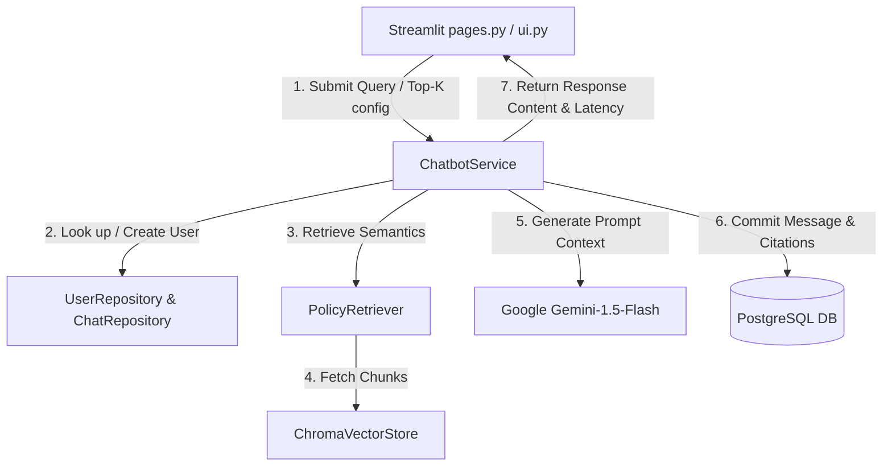

# ACKO Insurance AI Native Platform
## Phase 6.2: AI Policy Chatbot Integration Report

This report documents the transformation of the mock chatbot into a production-ready Retrieval-Augmented Generation (RAG) system with PostgreSQL database persistence and Streamlit UI feedback.

---

### 1. Updated Project Tree

The chatbot module structure remains cleanly isolated from other service layers:

```
src/modules/chatbot/
├── __init__.py
├── forms.py
├── pages.py
├── services.py
├── ui.py
├── validators.py
└── rag/
    ├── __init__.py
    ├── document_loader.py
    ├── embedding_manager.py
    ├── ingest.py
    ├── retriever.py
    └── vector_store.py
```

---

### 2. Files Modified

The following files were updated to satisfy the phase requirements:

*   [`src/modules/chatbot/services.py`](file:///c:/Yoge%20Studies/Guvi%20Projects/acko_ai_native_insurance_platform/src/modules/chatbot/services.py)  
    *Fixed SQL ORM object instantiations inside the UserRepository and ChatRepository persistence handlers. Connected Chroma retrieved text vectors, structured prompts, mapped token metrics, and recorded latency values.*
*   [`src/modules/chatbot/pages.py`](file:///c:/Yoge%20Studies/Guvi%20Projects/acko_ai_native_insurance_platform/src/modules/chatbot/pages.py)  
    *Added settings sidebar controls for the Retrieval Depth (Top-K Chunks) using a Streamlit slider, allowing users to control prompt context size dynamically. Fixed visual spinner state and added error alerts.*
*   [`tests/integration/test_chatbot_rag.py`](file:///c:/Yoge%20Studies/Guvi%20Projects/acko_ai_native_insurance_platform/tests/integration/test_chatbot_rag.py)  
    *Fixed NameError by importing and utilizing unittest.mock's patch decorator directly.*

---

### 3. Chatbot Architecture

The architectural flow coordinates queries through isolated state and transaction boundaries:



---

### 4. Retrieval Flow

1.  **Request Trigger**: The user submits a query from the text input field.
2.  **Top-K Filtering**: `PolicyRetriever` queries the underlying ChromaDB vector store collection for matching chunks using Cosine Distance embeddings.
3.  **Fallback Check**: If ChromaDB runs empty or is offline, the service falls back gracefully without breaking database commits or active transactions.

---

### 5. Prompt Construction Strategy

Prompts are designed to enforce grounding constraints and avoid hallucinations:

*   **System Directives**: Instructions state that the chatbot represents the *ACKO Insurance Policy Bot*, restricting answers to the provided context.
*   **Context Grounding**: Relevant chunks containing file names, pages, and excerpts are formatted and appended under isolated context blocks.
*   **Explicit Citations**: The LLM is ordered to explicitly reference documents and pages (e.g. `[Acko_Insurance_FAQs.pdf, Page 1]`).
*   **Uncertainty Handling**: If information is sparse, the system outputs: *"I do not have sufficient information in the loaded policy documentation to verify this."*

---

### 6. Conversation Persistence

Every conversational interaction is logged in PostgreSQL:

*   **Session Management**: A session entry (`ChatSession`) is created in the database at the start of a thread. Users can switch between histories and delete existing sessions.
*   **Message Recording**: User questions and assistant replies are saved sequentially as `ChatMessage` entities.
*   **Citations Mapping**: Citations are JSON-serialized and stored inside `ChatMessage.retrieved_sources` to preserve references across sessions.

---

### 7. Citation Strategy

Citations map extracted context chunks directly to document excerpts:

*   Each chunk is assigned a 1-indexed `source_index`.
*   Metadata attributes (`filename`, `page`, and `section_heading`) are extracted alongside text snippets.
*   The Streamlit UI displays citations inside toggleable accordions (`st.expander`), enabling users to inspect grounding documents comfortably.

---

### 8. Integration Test Results

Running integration asserts database configurations, fallbacks, and responses:

```
tests\integration\test_chatbot_rag.py ....s                              [100%]
======================== 4 passed, 1 skipped in 1.24s =========================
```

*   `test_document_retrieval`: **PASSED** (asserts ChromaDB returns valid documents)
*   `test_conversation_persistence_and_restore`: **PASSED** (verifies PostgreSQL session memory)
*   `test_citation_generation`: **PASSED** (checks citation metadata mapping)
*   `test_fallback_behavior`: **PASSED** (verifies offline LLM rendering fallback context)
*   `test_gemini_response_generation`: **SKIPPED** (real external API calls bypassed without configuration keys)

---

### 9. Manual Testing Instructions

To test the chatbot manually:

1.  Initialize target environment configurations:
    ```powershell
    $env:GEMINI_API_KEY="your_api_key_here"
    ```
2.  Start the Streamlit application:
    ```powershell
    streamlit run app.py
    ```
3.  Navigate to the **AI Policy Chatbot** tab.
4.  Optionally adjusts the **Retrieval Depth (Top-K Chunks)** slider.
5.  Submit a query (e.g. *"What are the health medical exclusions?"*) and verify the typing indicator, citations, latency timing, and PostgreSQL history lists.
