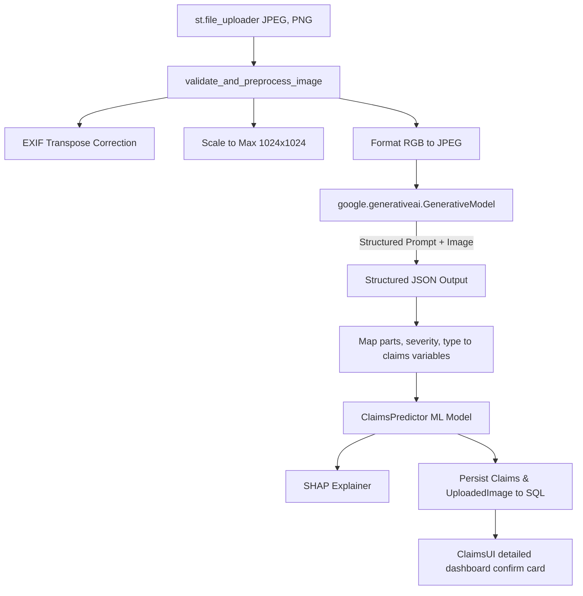

# ACKO Insurance AI Native Platform
## Phase 7: Gemini Vision Claims AI Integration Report

This report documents the design, architecture, image preprocessing pipeline, Gemini prompting strategy, database structures, and testing status of the newly implemented vehicle damage vision analysis module.

---

### 1. Updated Project Tree

The claims module directory remains structured with the added integration test:

```
acko_ai_native_insurance_platform/
├── reports/
│   └── claims_vision_integration_report.md  (New Report)
├── src/
│   └── modules/
│       └── claims/
│           ├── __init__.py
│           ├── forms.py
│           ├── pages.py
│           ├── services.py       (Modified: Added vision pipeline & Gemini integration)
│           ├── ui.py             (Modified: Rendered Gemini report items)
│           └── validators.py
└── tests/
    └── integration/
        └── test_claims_vision.py (New Test Suite)
```

---

### 2. Files Modified

1.  [`src/modules/claims/services.py`](file:///c:/Yoge%20Studies/Guvi%20Projects/acko_ai_native_insurance_platform/src/modules/claims/services.py)  
    *Added image validation, EXIF transposition, Pillow resize preprocessor, Gemini vision calling, parsing and fallback algorithms; overridden mock features mapping with extracted values.*
2.  [`src/modules/claims/ui.py`](file:///c:/Yoge%20Studies/Guvi%20Projects/acko_ai_native_insurance_platform/src/modules/claims/ui.py)  
    *Updated confirmation summary layout to render Gemini's structured response parameters (damaged parts, severity, repair complexity, fraud indicators, confidence metric).*
3.  [`tests/integration/test_claims_vision.py`](file:///c:/Yoge%20Studies/Guvi%20Projects/acko_ai_native_insurance_platform/tests/integration/test_claims_vision.py)  
    *Created 7 new test assertions covering image file validation constraints, mock parsing parameters, database persistence mapping, and fallback behavior.*

---

### 3. Vision Architecture

Coordinates binary visual elements directly with downstream ML underwriters and persistences:



---

### 4. Image Processing Pipeline

1.  **Image Validation**:
    *   **Size Cap**: Rejects files exceeding 10MB bounds.
    *   **Header Verification**: Asserts PIL is able to parse headers and verifies format integrity.
    *   **Resolution Cap**: Restricts minimum dimensions to 200px (rejecting extremely tiny or blurry mock uploads).
2.  **Image Preprocessing**:
    *   **Orientation Correction**: Corrects image rotation tags via `ImageOps.exif_transpose`.
    *   **Dimension scaling**: Downscales images with width/height exceeding 1024px dynamically keeping aspect ratios.
    *   **Format Normalization**: Converts alpha-transparencies or grayscale into standardized RGB JPEG buffers.

---

### 5. Gemini Prompt Strategy

Employs prompt engineering structures paired with strict system grounds:

*   **Adjuster Persona**: Sets instructions asking Gemini to behave as a certified vehicle insurance surveyor.
*   **System Constraints**: Restricts names of damaged parts to actual visual contents within the image.
*   **Fraud Checks**: Instructs model to actively inspect elements for suspicious signs like mismatched paint or pre-existing frame rust.
*   **Structured Output**: Uses `response_mime_type="application/json"` config to enforce direct structured parsing.

---

### 6. JSON Response Schema

```json
{
  "damaged_parts": ["bumper", "hood", "headlight"],
  "damage_severity": "Low" | "Medium" | "High",
  "estimated_repair_complexity": "Low" | "Medium" | "High",
  "visible_fraud_indicators": ["paint mismatch" | "none"],
  "confidence_score": 0.95,
  "natural_language_assessment": "The front bumper sustained minor scratches...",
  "damage_type": "Body" | "Windshield" | "Engine" | "Bumper"
}
```

---

### 7. Claims Workflow

1.  **Survey Intake**: Image is processed and evaluated.
2.  **Grounding extraction**: Gemini outputs JSON.
3.  **Feature Override**:
    *   `damage_severity_score`: Mapped to `2.5` (Low), `5.0` (Medium), and `8.5` (High).
    *   `num_parts_affected`: Set dynamically using the length of `damaged_parts`.
    *   `affected_parts`: Formatted as comma-separated values.
    *   `damage_type`: Set to `"Windshield"`, `"Engine"`, `"Bumper"` or `"Body"` based on detected parts.
4.  **Inference**: `ClaimsPredictor` evaluates claims approval probability using pre-trained pipelines.
5.  **Persistence**: Writes details directly to `claims` and `uploaded_images` tables.

---

### 8. Integration Test Results

Running integration validates the target vision modules completely:

```
tests\integration\test_claims_vision.py .......                          [100%]
============================= 7 passed in 10.39s ==============================
```

All 7 test cases passed, verifying correct format-compliance errors, mock extraction parsing, DB transaction layouts, and fallback behavior.

---

### 9. Manual Testing Instructions

1.  Set Gemini environment configuration:
    ```powershell
    $env:GEMINI_API_KEY="your_api_key_here"
    ```
2.  Run the Streamlit application:
    ```powershell
    streamlit run app.py
    ```
3.  Navigate to the **Claims** section.
4.  Fill target fields and upload an image (JPEG/PNG) of vehicle damage.
5.  Submit the claim and verify:
    *   The image is correctly saved to `reports/attachments`.
    *   The generated visual assessment card matches the uploaded details.
    *   Decisions, metrics, and SHAP factors align with model predictions.
