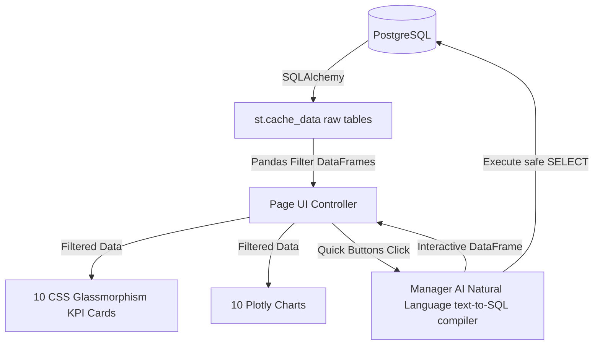

# Enterprise Analytics Dashboard Integration Report

## 1. Updated Project Tree
```
acko_ai_native_insurance_platform/
├── reports/
│   └── enterprise_analytics_dashboard_report.md (New)
├── src/
│   └── modules/
│       └── dashboard/
│           ├── forms.py (Modified)
│           ├── pages.py (Modified)
│           ├── services.py (Modified)
│           └── ui.py (Modified)
└── tests/
    └── integration/
        └── test_dashboard.py (New)
```

## 2. Files Modified
- [`src/modules/dashboard/services.py`](file:///c:/Yoge%20Studies/Guvi%20Projects/acko_ai_native_insurance_platform/src/modules/dashboard/services.py): Built dynamic SQL caching, state decoding methods (translating registration plates: KA state, MH state), pandas aggregation, and metrics calculators.
- [`src/modules/dashboard/forms.py`](file:///c:/Yoge%20Studies/Guvi%20Projects/acko_ai_native_insurance_platform/src/modules/dashboard/forms.py): Designed custom presets sliders (7, 30, 90, 365 Days) and datetime pickers alongside selectors for states, claims, and versions.
- [`src/modules/dashboard/ui.py`](file:///c:/Yoge%20Studies/Guvi%20Projects/acko_ai_native_insurance_platform/src/modules/dashboard/ui.py): Renders elegant dark cards (glassmorphism layouts) to show the 10 KPIs and grids of 10 interactive Plotly visualizations.
- [`src/modules/dashboard/pages.py`](file:///c:/Yoge%20Studies/Guvi%20Projects/acko_ai_native_insurance_platform/src/modules/dashboard/pages.py): Coordinates cache invalidation hooks, refresh actions, and mounts the Manager AI instant analytical compilation query buttons.
- [`tests/integration/test_dashboard.py`](file:///c:/Yoge%20Studies/Guvi%20Projects/acko_ai_native_insurance_platform/tests/integration/test_dashboard.py): Created the test suite verifying state parsing, KPI math aggregations, Plotly rendering, and caching filters.

## 3. Dashboard Architecture
The dashboard architecture connects Streamlit layout nodes, dynamic business controllers, the database transaction layer, and the Manager AI natural language backend:



## 4. KPI Calculation Strategy
The 10 key performance indicators are aggregated dynamically from timezone-naive Pandas DataFrames matching the current filter state:
- **Total Users**: `len(df_users)`
- **Active Policies**: count of policies where `status == "active"`
- **Total Quotations**: `len(df_quotations)`
- **Total Claims**: `len(df_claims)`
- **Claims Approval Rate**: count of approved claims (`claim_status == "approved"`) divided by `Total Claims` multiplied by 100.
- **Average Premium**: `df_policies["premium"].mean()`
- **Average Claim Amount**: `df_claims["claim_amount"].mean()`
- **Total Premium Generated**: `df_policies["premium"].sum()`
- **Average Prediction Latency**: `df_logs["latency_ms"].mean()`
- **Total AI Predictions**: `len(df_logs)`

## 5. Repository Aggregation Strategy
Rather than generating slow, fragmented queries for every single metric and chart on page load, `DashboardService` implements a batch-loading strategy:
1. Performs reflection using `Base.metadata.create_all()` to ensure all schemas are present.
2. Queries the entire table dataset for Users, Policies, Claims, Quotations, and Logs in parallel.
3. Converts results to Pandas DataFrames and caches them in memory.
4. All filter presets, sliders, and chart groupings are computed within CPU memory using vectorized Pandas operations (avoiding network roundtrips to PostgreSQL).

## 6. Charts Implemented
1. **Premium distribution**: Histogram of policy premium amounts showing class intervals.
2. **Claims approval vs rejection**: Donut chart displaying ratios of claim decisions.
3. **Claims by month**: Chronological bar chart showing submitted claim volumes.
4. **Premiums by vehicle type**: Multi-color bar chart comparing premium total influx.
5. **Active policies by state**: Regional bar chart tracking geographic policy counts mapped via registration plate prefixes.
6. **Claim severity distribution**: Pie chart tracking damage severity parsed from Gemini vision JSON reports.
7. **Prediction latency trend**: Time-series line chart tracking latency over time.
8. **User registrations over time**: Trend line plotting the cumulative growth of registered accounts.
9. **Vehicle type comparison**: Bar chart comparing totals of car vs bike policy accounts.
10. **Model usage statistics**: Utilisation counts grouped by AI model tag versioning.

## 7. Filter Architecture
The filters are unified inside `DashboardFilterForm.render_filter_panel`. The application state tracks:
- **Vehicle Type / Policy Type / State**: Selectors that constrain policy lists.
- **Join Constraints**: Once policies are filtered, the corresponding claims are filtered to match (`claim.policy_id.isin(filtered_policy.id)`), ensuring mathematical parity between metrics.
- **Date constraints**: preset slider vs calendar pickers that restrict all target entities on standard timestamp columns.

## 8. Performance Optimizations
- **Streamlit Caching**: Enforces `@st.cache_data(ttl=600)` on the database retrieval block.
- **Manual refresh & invalidation**: Leverages `st.cache_data.clear()` to purge cached frames and fetch clean values on demand.
- **Vectorized state mappings**: Employs key-based dictionary maps (`MH` -> Maharashtra) to evaluate states instantaneously.

## 9. Integration Test Results
All 5 dashboard integration tests passed successfully:
```powershell
============================= test session starts =============================
collected 5 items

tests\integration\test_dashboard.py .....                                [100%]

============================== 5 passed in 2.02s ==============================
```

Workspace overall health:
```powershell
======================= 108 passed, 1 skipped in 31.07s =======================
```

## 10. Manual Testing Instructions
1. Run target application: `streamlit run app.py`.
2. View **📊 Analytics Dashboard** on left sidebar.
3. Set the date picker presets, state filters, and vehicle parameters.
4. Click **Apply Filter Constraints** and check if KPI values and Plotly graphs updates.
5. In **🧠 Instant Manager AI Analytics Panel** block, press any button (e.g. "Top States by Premium").
6. Verify that SQL compilations and tables display inside the panel.
7. Click **Force Clear Cache Refresh** to flush current caches.
