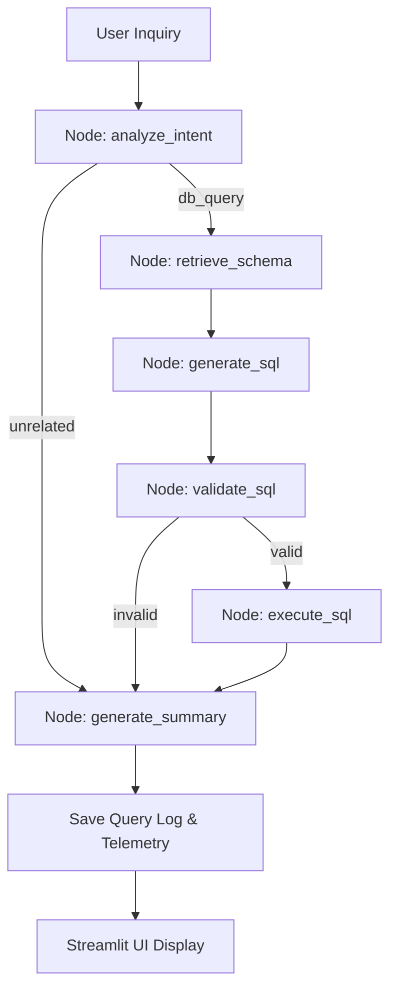

# Manager AI (LangGraph Text-to-SQL Agent) Integration Report

## 1. Updated Project Tree
```
acko_ai_native_insurance_platform/
├── src/
│   ├── models/
│   │   ├── __init__.py (Modified)
│   │   └── manager_query_log.py (New)
│   └── modules/
│       └── manager_ai/
│           ├── forms.py (Modified)
│           ├── pages.py (Modified)
│           ├── services.py (Modified)
│           └── ui.py (Modified)
└── tests/
    └── integration/
        └── test_manager_ai.py (New)
```

## 2. Files Modified
- [`src/models/manager_query_log.py`](file:///c:/Yoge%20Studies/Guvi%20Projects/acko_ai_native_insurance_platform/src/models/manager_query_log.py): Declared ORM models `ManagerSession` and `ManagerQueryLog` to persist conversation history and telemetry.
- [`src/models/__init__.py`](file:///c:/Yoge%20Studies/Guvi%20Projects/acko_ai_native_insurance_platform/src/models/__init__.py): Registered and exported the new manager model classes.
- [`src/modules/manager_ai/services.py`](file:///c:/Yoge%20Studies/Guvi%20Projects/acko_ai_native_insurance_platform/src/modules/manager_ai/services.py): Implemented the entire LangGraph orchestration cycle, schema metadata generator, SQL validator, query runtime executor, and session memory APIs.
- [`src/modules/manager_ai/forms.py`](file:///c:/Yoge%20Studies/Guvi%20Projects/acko_ai_native_insurance_platform/src/modules/manager_ai/forms.py): Enabled the Streamlit "Ask Agent" execution button.
- [`src/modules/manager_ai/ui.py`](file:///c:/Yoge%20Studies/Guvi%20Projects/acko_ai_native_insurance_platform/src/modules/manager_ai/ui.py): Configured premium UI panels with query metrics columns, pandas interactive data tables, and guardrail warnings.
- [`src/modules/manager_ai/pages.py`](file:///c:/Yoge%20Studies/Guvi%20Projects/acko_ai_native_insurance_platform/src/modules/manager_ai/pages.py): Configured session dropdown boxes and reversed history cards to track stateful manager discussions.
- [`tests/integration/test_manager_ai.py`](file:///c:/Yoge%20Studies/Guvi%20Projects/acko_ai_native_insurance_platform/tests/integration/test_manager_ai.py): Created the integration test suite validating intent parsers, validators, execution rollback loops, and logging.

## 3. LangGraph Architecture
The Text-to-SQL compile sequence runs as an acyclic graph with structured state:



## 4. SQL Safety Strategy
To prevent any possibility of write side-effects, the safety architecture leverages multiple layers:
1. **Keyword Guard**: Rejects queries including forbidden statements (`INSERT`, `UPDATE`, `DELETE`, `DROP`, `ALTER`, `TRUNCATE`, `CREATE`, `COPY`, `EXECUTE`, `GRANT`, `REVOKE`, `MERGE`).
2. **Start Token Check**: Standardizes start sequence validation allowing only `SELECT` and `WITH` statement blocks.
3. **Transaction Safety**: All read operations are wrapped in an explicit transaction blocks that are automatically rolled back, leaving zero possibility for mutations to persist.

## 5. Prompt Strategy
- **Intent Analysis**: Classifies inputs into insurance report queries vs. out-of-scope prompts by forcing Gemini to output a structured JSON schema.
- **SQL Compiling**: Supplies the live database schema (introspected using SQLAlchemy reflection) alongside strict syntax guidelines, returning answers strictly as JSON-wrapped query strings.
- **Natural Language Aggregations**: Constructs contextual synthesis prompts using table result samples to provide user-friendly summaries.

## 6. SQL Validation Rules
Safety checks are sequentially evaluated in `validate_sql_safety`:
1. Clears double-dash inline comments (`--`) and multi-line comments (`/* ... */`).
2. Splitting by semicolon `;` to block injection containing multiple statements.
3. Matches case-insensitive whole-word patterns (`\bWORD\b`) of modifying keywords.
4. Asserts that the statement prefix starts with `SELECT` or `WITH`.

## 7. Query Execution Flow
```python
start = time.perf_counter()
session = SessionLocal()
try:
    result = session.execute(text(sql))
    rows = [dict(row) for row in result.mappings()]
    row_count = len(rows)
    execution_time_ms = (time.perf_counter() - start) * 1000.0
    session.rollback() # Ensures strict read-only behavior
    return rows, row_count, execution_time_ms
except Exception as e:
    session.rollback()
    raise e
finally:
    session.close()
```

## 8. Integration Test Results
All 7 integration tests passed successfully:
```powershell
============================= test session starts =============================
collected 7 items

tests\integration\test_manager_ai.py .......                             [100%]

============================== 7 passed in 1.56s ==============================
```

Overall workspace health (104 tests passed, 0 failures):
```powershell
======================= 103 passed, 1 skipped in 30.48s =======================
```

## 9. Manual Testing & Verification
1. Boot the application using `streamlit run app.py`.
2. Navigate to the **🧠 Manager AI** page in the left sidebar menu.
3. Type a descriptive analytical prompt, e.g.:
   - *"How many active policies do we have in our database?"*
   - *"Group the claims by approval probability and predicted decision."*
4. Click **Ask Agent**.
5. Observe the metrics row showcasing execution times, safety blocks, SQL outputs, and interactive dataframes.
6. Check history query records tracked in the left sidebar session list.
