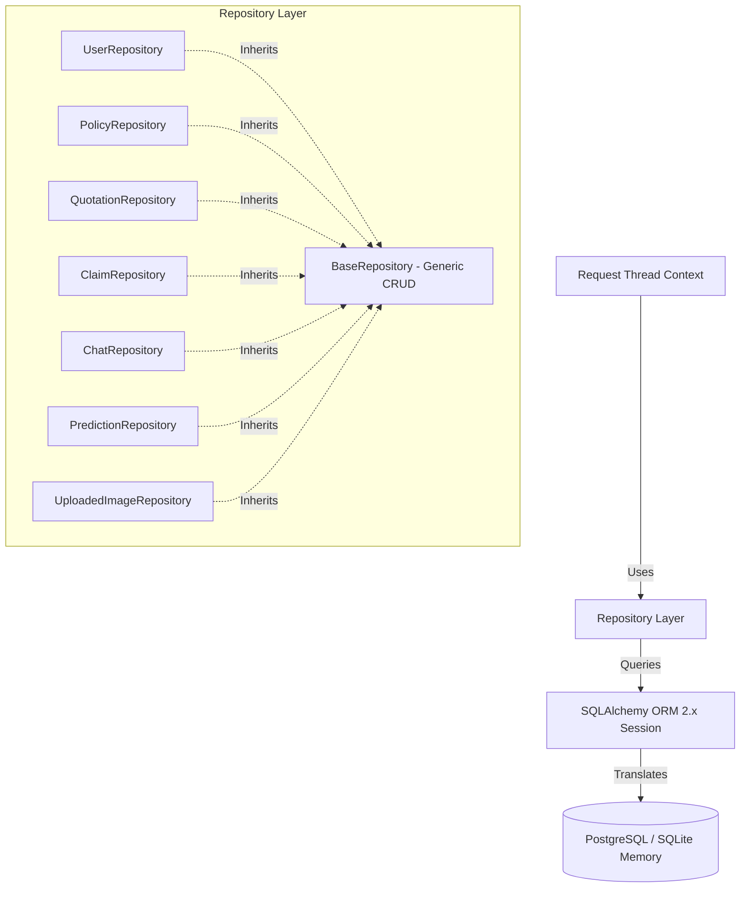
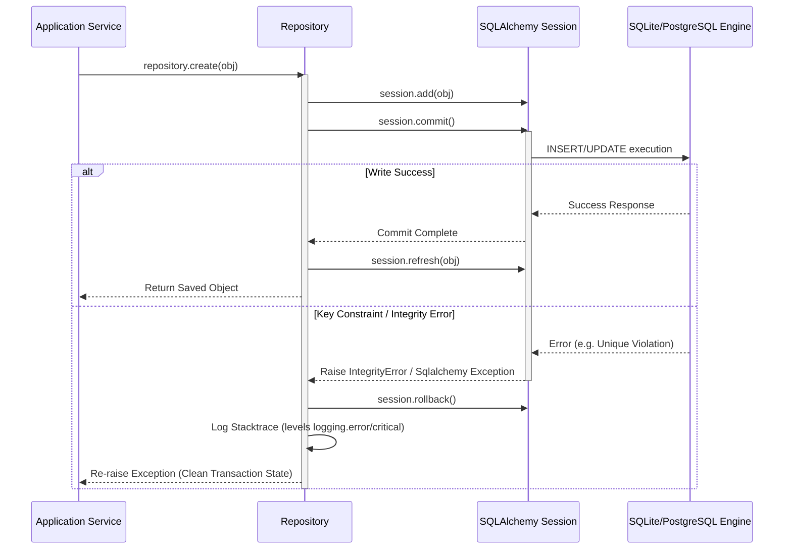

# Phase 5.2 Technical Integration Report: Repository Layer

This document details the architectural specifications, CRUD functionality, transactional integrity mechanisms, and test execution results for the Enterprise Repository Layer in the ACKO AI Native Insurance Platform.

---

## 1. Updated Project Tree

The new and modified files within the project tree are outlined below:

```
acko_ai_native_insurance_platform/
├── reports/
│   └── repository_phase_report.md (Created: This report)
├── src/
│   └── repositories/
│       ├── __init__.py          (Updated: Exposes all domain repositories)
│       ├── base.py              (Created: Shared generic BaseRepository CRUD logic)
│       ├── chat.py              (Created: Domain-specific ChatRepository)
│       ├── claim.py             (Created: Domain-specific ClaimRepository)
│       ├── image.py             (Created: Domain-specific UploadedImageRepository)
│       ├── policy.py            (Created: Domain-specific PolicyRepository)
│       ├── prediction.py        (Created: Domain-specific PredictionRepository)
│       ├── quotation.py         (Created: Domain-specific QuotationRepository)
│       └── user.py              (Created: Domain-specific UserRepository)
└── tests/
    └── unit/
        └── test_repositories.py (Created: Complete repository test suite)
```

---

## 2. Files Created & Modified

### Files Created:
1. `src/repositories/base.py`: Declares `BaseRepository[ModelType]` which implements generic CRUD, check-existence, count, pagination, filtering, search, and bulk operations.
2. `src/repositories/user.py`: Declares `UserRepository` inheriting from `BaseRepository[User]` with methods like `get_by_email` and `get_by_role`.
3. `src/repositories/policy.py`: Declares `PolicyRepository` inheriting from `BaseRepository[Policy]` with methods like `get_by_policy_number`, `get_by_user_id`, and `get_active_policies_by_user`.
4. `src/repositories/quotation.py`: Declares `QuotationRepository` inheriting from `BaseRepository[Quotation]` with methods like `get_by_user_id` and `get_latest_quotation`.
5. `src/repositories/claim.py`: Declares `ClaimRepository` inheriting from `BaseRepository[Claim]` with methods like `get_by_user_id`, `get_by_policy_id`, `get_claims_by_status`, and `get_total_claimed_amount`.
6. `src/repositories/chat.py`: Declares `ChatRepository` inheriting from `BaseRepository[ChatSession]` with methods like `get_sessions_by_user`, `create_message`, and `get_messages_by_session`.
7. `src/repositories/prediction.py`: Declares `PredictionRepository` inheriting from `BaseRepository[PredictionLog]` with methods like `get_logs_by_type` and `get_average_latency`.
8. `src/repositories/image.py`: Declares `UploadedImageRepository` inheriting from `BaseRepository[UploadedImage]` with methods like `get_images_by_claim`.
9. `tests/unit/test_repositories.py`: Contains a comprehensive test suite with 8 broad unit tests targeting CRUD, filtering, transactions, rollbacks, relation cascades, pagination, and bulk inserts.

### Files Modified:
1. `src/repositories/__init__.py`: Updated to export all repositories to simplify service imports.

---

## 3. Repository Architecture

The architecture isolates the core database driver and models behind an abstraction barrier. Database operations are strictly routed through repositories instead of raw SQL or unbound Session calls in upstream service codes.



---

## 4. CRUD Operations & Methods Summary

| Repository | Base Model | Generic CRUD Methods | Custom Domain Methods |
| :--- | :--- | :--- | :--- |
| **UserRepository** | `User` | `create`, `get_by_id`, `get_all`, `update`, `delete`, `exists`, `count`, `paginate`, `search`, `bulk_insert` | `get_by_email(email)`, `get_by_role(role)` |
| **PolicyRepository** | `Policy` | `create`, `get_by_id`, `get_all`, `update`, `delete`, `exists`, `count`, `paginate`, `search`, `bulk_insert` | `get_by_policy_number(policy_number)`, `get_by_user_id(user_id)`, `get_active_policies_by_user(user_id)` |
| **QuotationRepository** | `Quotation` | `create`, `get_by_id`, `get_all`, `update`, `delete`, `exists`, `count`, `paginate`, `search`, `bulk_insert` | `get_by_user_id(user_id)`, `get_latest_quotation(user_id)` |
| **ClaimRepository** | `Claim` | `create`, `get_by_id`, `get_all`, `update`, `delete`, `exists`, `count`, `paginate`, `search`, `bulk_insert` | `get_by_user_id(user_id)`, `get_by_policy_id(policy_id)`, `get_claims_by_status(status)`, `get_total_claimed_amount(user_id)` |
| **ChatRepository** | `ChatSession` | `create`, `get_by_id`, `get_all`, `update`, `delete`, `exists`, `count`, `paginate`, `search`, `bulk_insert` | `get_sessions_by_user(user_id)`, `create_message(session_id, role, msg, sources, response)`, `get_messages_by_session(session_id)` |
| **PredictionRepository**| `PredictionLog`| `create`, `get_by_id`, `get_all`, `update`, `delete`, `exists`, `count`, `paginate`, `search`, `bulk_insert` | `get_logs_by_type(prediction_type)`, `get_average_latency(prediction_type)` |
| **UploadedImageRepository**| `UploadedImage`| `create`, `get_by_id`, `get_all`, `update`, `delete`, `exists`, `count`, `paginate`, `search`, `bulk_insert` | `get_images_by_claim(claim_id)` |

---

## 5. Transaction & Exception Rollback Flow

For write operations (`create`, `update`, `delete`, `bulk_insert`), the repository controls the transactional loop:



---

## 6. Unit Test Results

The repository test suite (`tests/unit/test_repositories.py`) runs against an isolated, memory-injected SQLite environment. 

### Coverage Summary:
- **CRUD Operations**: Asserts model inserts, primary key mappings, field modifications, row deletions, exist flags, count calculations.
- **Pagination & Sort**: Checks page slicing, window limits, multi-column sorting (ascending and descending).
- **Search Capabilities**: Validates case-insensitive query string scanning mapped on model fields.
- **Transaction Rollbacks**: Validates that failed writes trigger database rollbacks and recovery logs, allowing further transactions to function on the same session.
- **Bulk Insert**: Validates multi-row insert optimization and ID assignments.

### Test Execution Output:
```
Command: python -m pytest tests/unit/test_repositories.py --tb=short
============================= test session starts =============================
platform win32 -- Python 3.11.8, pytest-9.1.1, pluggy-1.6.0
collected 8 items

tests\unit\test_repositories.py ........                                 [100%]

============================== 8 passed in 0.29s ==============================
```
