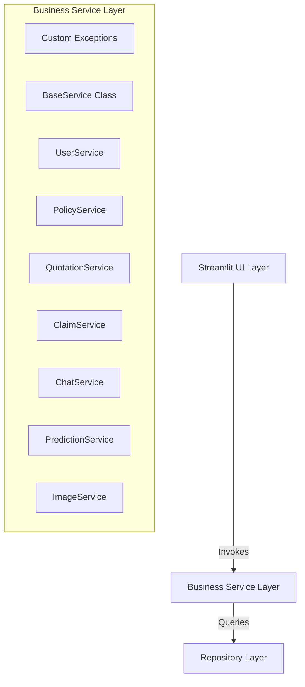

# Phase 5.3 Technical Integration Report: Business Service Layer

This report details the architectural design, dependency injection routing, input/business validations, custom exception rules, and unit test outputs for the Business Service Layer in the ACKO AI Native Insurance Platform.

---

## 1. Updated Project Tree

The new and modified files within the project tree are outlined below:

```
acko_ai_native_insurance_platform/
├── reports/
│   ├── repository_phase_report.md (Created in Phase 5.2)
│   └── service_phase_report.md    (Created: This report)
├── src/
│   └── services/
│       ├── __init__.py            (Updated: Exposes all business services and custom exceptions)
│       ├── base_service.py        (Created: Core BaseService orchestrator class)
│       ├── chat_service.py        (Created: Injects ChatRepository, governs support threads)
│       ├── claim_service.py       (Created: Injects ClaimRepository, User/Policy repos, controls claims validation)
│       ├── exceptions.py          (Created: Centralized platform exceptions declarations)
│       ├── image_service.py       (Created: Injects UploadedImageRepository, manages media records)
│       ├── policy_service.py      (Created: Injects PolicyRepository, verifies active coverage dates)
│       ├── prediction_service.py  (Created: Injects PredictionRepository, manages telemetry logging)
│       ├── quotation_service.py   (Created: Injects QuotationRepository, user quotes history)
│       └── user_service.py        (Created: Injects UserRepository, processes account creations)
└── tests/
    └── unit/
        └── test_services.py       (Created: Complete services unit test suite)
```

---

## 2. Files Created & Modified

### Files Created:
1. `src/services/exceptions.py`: Custom corporate exceptions like `ValidationError`, `ResourceNotFoundError`, `DuplicateResourceError`, and `BusinessRuleViolationError`.
2. `src/services/base_service.py`: Establishes the generic service skeleton inheriting logging channels and dependency-injecting a repository class.
3. `src/services/user_service.py`: Customer sign-ups, checks for email availability format rules, and filters users.
4. `src/services/policy_service.py`: Enforces positive values check (premium, IDV), date boundaries alignment, and checks active statuses (dynamic expiry state updates).
5. `src/services/quotation_service.py`: Records client premium searches and extracts historical records.
6. `src/services/claim_service.py`: Limits claim amounts by policy IDV capacity, invalidates claims against expired policies, and updates claims statuses.
7. `src/services/chat_service.py`: Support chat session initiation and chronological messages ledger mapping.
8. `src/services/prediction_service.py`: Latency logging and telemetry auditing.
9. `src/services/image_service.py`: Attachment metadata management.
10. `tests/unit/test_services.py`: Test suite verifying service layer logic.

### Files Modified:
1. `src/services/__init__.py`: Exports all custom services and exception classes.

---

## 3. Service Architecture

The Service Layer encapsulates all system rules, validations, and custom exception workflows.



---

## 4. Dependency Diagram

Each business service uses **Dependency Injection** by receiving its respective repository (and any related repositories required to enforce cross-entity rules) through its constructor.

```mermaid
classDiagram
    class UserService {
        +UserRepository repository
        +register_user()
        +get_user_by_id()
    }
    class PolicyService {
        +PolicyRepository repository
        +UserRepository user_repository
        +create_policy()
        +validate_policy_active()
    }
    class QuotationService {
        +QuotationRepository repository
        +UserRepository user_repository
        +create_quotation()
    }
    class ClaimService {
        +ClaimRepository repository
        +PolicyRepository policy_repository
        +UserRepository user_repository
        +submit_claim()
        +update_claim_status()
    }
    class ChatService {
        +ChatRepository repository
        +UserRepository user_repository
        +create_session()
        +add_message()
    }
    class PredictionService {
        +PredictionRepository repository
        +log_prediction()
    }
    class ImageService {
        +UploadedImageRepository repository
        +ClaimRepository claim_repository
        +register_image()
    }

    UserService --> UserRepository
    PolicyService --> PolicyRepository
    PolicyService --> UserRepository
    QuotationService --> QuotationRepository
    QuotationService --> UserRepository
    ClaimService --> ClaimRepository
    ClaimService --> PolicyRepository
    ClaimService --> UserRepository
    ChatService --> ChatRepository
    ChatService --> UserRepository
    PredictionService --> PredictionRepository
    ImageService --> UploadedImageRepository
    ImageService --> ClaimRepository
```



---

## 5. Business Operations & Validations Summary

| Operation (Service Method) | Inputs Validated | Business Rules Enforced | Custom Exceptions Raised |
| :--- | :--- | :--- | :--- |
| **`register_user`** | Name presence, Regex Email, valid string roles | Confirms email uniqueness (duplicate check) | `ValidationError`, `DuplicateResourceError` |
| **`create_policy`** | Key fields presence, positive premium/IDV | Confirms user owner exists, confirms policy number uniqueness | `ValidationError`, `ResourceNotFoundError`, `DuplicateResourceError` |
| **`validate_policy_active`** | policy_id mapping existence | Automatically changes status to `expired` if current date > end date | `ResourceNotFoundError` |
| **`create_quotation`** | JSON not empty, positive premium value | Confirms requesting user exists | `ValidationError`, `ResourceNotFoundError` |
| **`submit_claim`** | Summary, valid approval probability, positive amount | Confirms user and policy exists, verifies policy status is `active`, asserts claim amount $\le$ Policy IDV | `ValidationError`, `ResourceNotFoundError`, `BusinessRuleViolationError` |
| **`update_claim_status`** | Status string value option | Enforces state options, sets `decided_at` timestamp if resolved | `ValidationError`, `ResourceNotFoundError` |
| **`create_session`** | Title string presence | Confirms user exists | `ValidationError`, `ResourceNotFoundError` |
| **`add_message`** | Msg content presence, valid roles | Confirms chat session ID exists | `ValidationError`, `ResourceNotFoundError` |
| **`log_prediction`** | Hashes presence, positive latency duration | Logs telemetries details | `ValidationError` |
| **`register_image`** | Filename, target save paths | Confirms claim ID exists | `ValidationError`, `ResourceNotFoundError` |

---

## 6. Unit Test Results

The service layer test suite (`tests/unit/test_services.py`) runs against an isolated, memory-injected SQLite environment. 

### Coverage Summary:
- **Dependency Injection**: Verifies constructors receive valid repositories and bind correctly.
- **Validations**: Asserts parameter checks, string validations, positive limits, and invalid inputs catch blocks.
- **Business Operations**: Verifies limits constraints (e.g. claim vs IDV caps), date ranges, active policy transitions, and unique key violations.
- **Exception Flow**: Checks that specific failure scenarios raise their respective custom exception class.

### Test Execution Output:
```
Command: python -m pytest tests/unit/test_services.py --tb=short
============================= test session starts =============================
platform win32 -- Python 3.11.8, pytest-9.1.1, pluggy-1.6.0
collected 7 items

tests\unit\test_services.py .......                                      [100%]

============================== 7 passed in 0.37s ==============================
```
